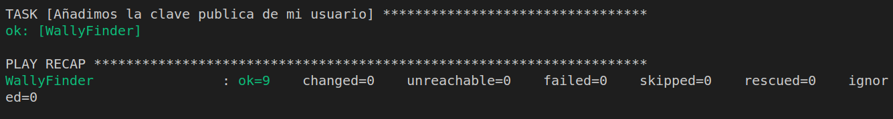
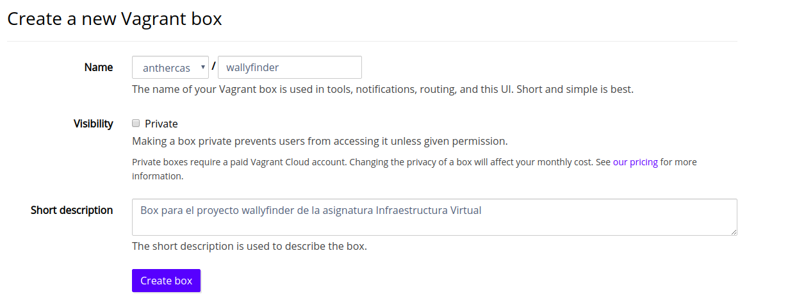
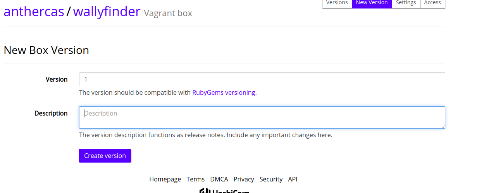
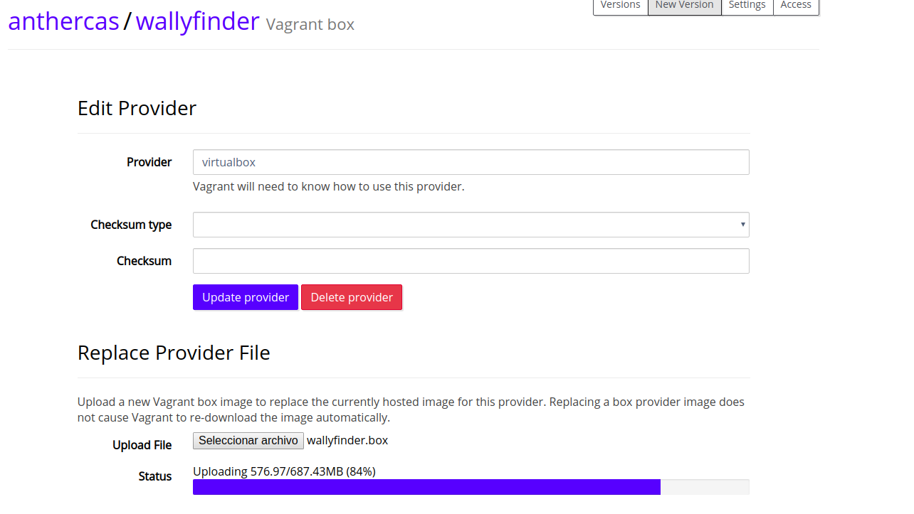

# Aprovisionamiento

En esta sección de la documentación vamos a explicar todo lo referente al aprovisionamiento. Desde los ficheros de configuración, lo necesario para ejecutarlo y como se realiza el despliegue en VagrantCloud. 

## Configuración maquina virtual

Para este propósito como hemos dicho anteriormente, vamos a usar Vagrant. Esta herramienta nos permite crear maquinas virtuales con un simple fichero de configuración. 

```
Vagrant.configure("2") do |config|
    #Nombre
    config.vm.define "WallyFinder"

    # Aunque la versión mas usada es ubuntu/trusty64, que es la 14.04, he decidido usar 
    # 18.04 porque todo mi sistema esta probado en esa versión
    config.vm.box = "ubuntu/bionic64"
   

    # Usamos la dirección ip local con el puerto 1234 tanto en el anfitrión como en el invitado
    config.vm.network "forwarded_port", guest: 1234, host: 1234, host_ip: "127.0.0.1"

    #Para evitar actualizaciones automaticas
    config.vm.box_check_update = false

    # Vamos a usar virtualbox de forma local 
    config.vm.provider "virtualbox" do |vb|
        #El nombre de la maquina
        vb.name = "WallyFinder"
        #La cantidad de memoria ram que tendra disponible. En mi caso 2GB
        vb.memory = "2048"
        #Y podra usar dos cores del procesador
        vb.cpus = 2
    end

    # Indicaremos que el aprovisionamiento lo realizara con el fichero de ansible
    # que se encuentra en la siguiente ruta
    config.vm.provision "ansible" do |ansible|
        ansible.playbook = "aprovisionamiento/playbook.yml"
    end
end
```
Aunque todas las lineas están comentadas voy a repasar un poco todas las opciones. 

Después del nombre que hemos puesto, nos encontramos la elección de la distribución. Aunque tal vez podria haber realizado pruebas con otras versiones, he elegido usar la versión 18.04 "bionic". Esto es asi ya que es la versión de Ubuntu donde he realizado todo el microservicio y todas las pruebas. 

La siguiente linea de configuración corresponde a cual va a ser la dirección y los puertos de la maquina anfitrión y la maquina invitado que va a usarla maquina virtual. En la siguiente configuración deshabilitamos las actualizaciones automáticas para evitar sistemas de compatibilidad. 

Lo siguiente que nos encontramos es la configuración que tendrá la maquina virtual. Indicamos que vamos a usar virtualbox. Ademas le damos un nombre a la maquina, una cantidad de memoria determinada y una cantidad de cores para utilizar. 

Por ultimo indicamos la ubicación del fichero de provisión. Como vamos a utilizar ansible lo indicamos y ademas indicamos la ruta donde se encuentra el fichero de configuración. 

## Aprovisionamiento con Ansible

En este punto explicaremos como debe ser el fichero de configuración de Ansible para poder aprovisionar la maquina virtual. El fichero de conrfiguracion se encuentra en la ruta [aprovisionamiento/playbook.yml](../aprovisionamiento/playbook.yml) desde la raiz del proyecto. El contenido del fichero es el siguiente. 
```
#Indicamos el nombre del host
- hosts: WallyFinder
  tasks:

    #Instalación de todas las dependencias necesarias en mi apliación
    - name: Instalamos git
      become: true
      apt:
        pkg: git
        state: present
        update_cache: true


    - name: Python
      become: true
      apt:
        pkg: python3
        state: present

    - name: NPM
      become: true
      apt:
        pkg: npm
        state: present

    - name: Pip
      become: true
      apt:
        pkg: python3-pip
        state: present

    - name: Instala PM2
      become: true
      npm:
        name: pm2
        global: yes

    - name: RabbitMQ
      become: true
      apt:
        pkg: rabbitmq-server
        state: present

    - name: Creando usuario
      become: true
      user:
        name: peasousuario
        shell: /bin/bash

    - name: Añadimos la clave publica de mi usuario
      become: true
      authorized_key:
        user: peasousuario
        state: present
        key: "{{ lookup('file', '/home/antonio/.ssh/id_rsa.pub') }}"
```
Como muchas de las task son casi idénticas. Voy a explicar los fundamentos de todas las que sean iguales y luego explicare los casos específicos. 

Como Vagran ya ha creado el inventario de todos los host solo tenemos que indicar el nombre en la linea primera linea. 

Voy a detallar las directrices de las tareas. Lo primero que nos encontramos es un nombre que le damos nosotros de forma arbitraria. En "become: true" especificamos que este comando se tiene que ejecutar como superusuario. Con "state:present" nos aseguramos que se instale el paquete. Otra directiva importante es "update_cache: true", que nos actualiza los repositorios. Si no, paquete como python3-pip no los encontraría y no podría instalarlos. 
 
En la tarea "- name: Creando usuario" como su nombre indica, estamos creando el usuario. Aunque solo elegimos el nombre del usuario y la shell que va a ejecutar. En la siguiente tarea es donde indicaremos que para el usuario "peasousuario" vamos a utilizar la clave publica que se encuentra en "/home/antonio/.ssh/id_rsa.pub" (la ruta corresponde a donde se encuentra la clave publica de mi ordenador, sustituir por la vuestra). Y con esto ya tendremos nuestra maquina virtual aprovisionada y lista para conectarse por ssh. 

## Como debemos usar los ficheros de configuración

Dando por hecho que ya tenemos Ansible y Vagrant en nuestro dispositivo y los ficheros de configuración. Haciendo uso de nuestro [Makefile](../Makefile) podremos aprovisionar la maquina virtual. 

Para crear la maquina virtual usando el fichero [Vagrantfile](../Vagrantfile) que hemos creado simplemente tendremos que ejecutar.

```
foo@bar:~$ make vagrant-configuracion
```
Esto leera el fichero de configuración y creara una maquina virtual con las especificaciones de la misma. 

Una vez que todo ha acabado, para ver si se ha realizado de forma correcta podemos usar el siguiente comando para ver si se ha creado de forma adecada. 
```
foo@bar:~$ vagrant ssh
```
Ahora ya solo nos falta aprovisionar esa maquina virtual que hemos creado. Para ello tenemos una directiva en el fichero Makefile y bastaria con ejecutar:

```
foo@bar:~$ make vagrant-provision
```

Si todo ha ido bien deberiamos ver una salida parecida a esta:



Para probar que se ha configurado de forma correcta podemos tambien probar que podamos conectarnos con la clave y usuario que hemos configurado. 
```
foo@bar:~$ ssh peasousuario@127.0.01 -p 2222
```
## Configuración de vagrant Cloud 

Lo primero que tenemos que hacer es crear una cuenta en Vagrant Cloud y crear una nueva "caja". 



Despues tenemos que crear la "caja" desde la terminal con el comando 
```
foo@bar:~$ vagrant package --output wallyfinder.box
```
Esto nos creara un fichero con el nombre "wallyfinder.box" que tendremos que subir a Vagran Cloud. 

Para ello tendremos que crear una nueva versión de nuestra box.


Y finalmente elegir el fichero "wallyfinder.box" y esperar hasta que se termine de subir. 



La "caja" la podremos encontrar [aqui](https://app.vagrantup.com/anthercas/boxes/wallyfinder). 