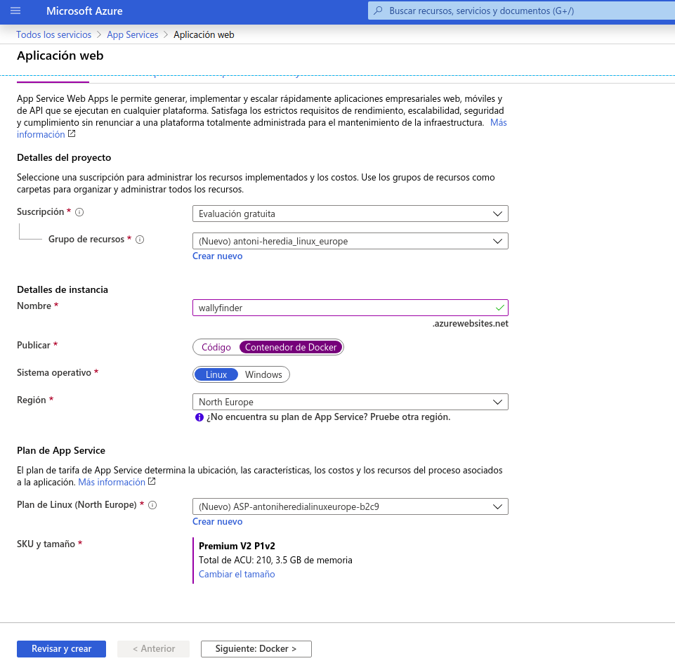
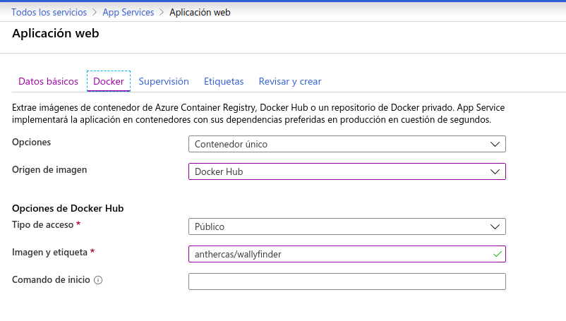

# Despliegue del microservicio usando docker
## Despliegue en Azure

Dando por hecho que ya tenemos nuestro contenedor en DockerHub, el despliegue en Azure es muy simple. 

Lo primero que tenemos que tener es una cuenta en Azure y un nuevo App Service. 

En el  momento de la creación debemos elegir __Publicar: Contenedor Docker__, darle el nombre que queramos e elegir una región, en nuestro caso usaremos Europa. 


En el siguiente paso tenemos que elegir el sitio donde se encuentra nuestro contenedor. En mi caso esta en DockerHub, aunque podria estar en Azure o en otro lugar. Como el contenedor es publico solo tenemos que añadir en imagen y etiqueta el nombre de nuestro contenedor que tiene en DockerHub.  


## Despliegue en Heroku

Para desplegar en Heroku lo haremos mediante su propio CLI. Lo primero que tendremos que hacer es crear un fichero llamado [heroku.yml](../heroku.yml). Donde indicaremos que el despliegue de esta aplicación se realizara a traves de contenedores usando el fichero Dockerfile. El contenido del fichero es el siguiente. 

```
build:
    docker:
        web: Dockerfile
```

Una vez creado el fichero realizaremos lo siguiente para poder loggearnos con nuestro usuario de heroku. 
```
foo@bar:~$ heroku login
```

Como ya tenemos la aplicación creada tenemos que indicarle a heroku que a partir de ahora nuestra app se desplegara mediante contenedores. 

```
foo@bar:~$ heroku stack:set container -a wallyfinder
```

Actualizamos la información del repositorio git de Heroku y listo. 

```
foo@bar:~$ git push heroku master
```

Una vez acabe el proceso el contenedor ya estar configurado y desplegado en Heroku. 