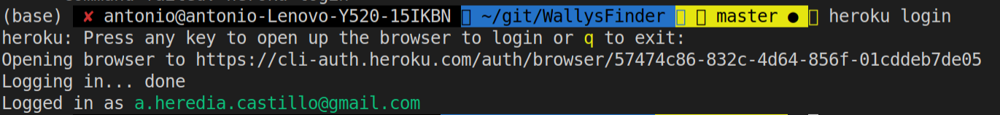
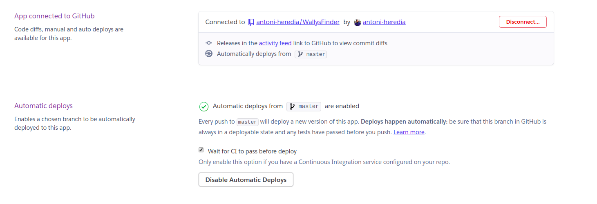

# Configurar PaaS
## Configuración Heroku

Lo primero que hay que realizar es instalar el [__CLI__](https://devcenter.heroku.com/articles/heroku-cli) que nos provee Heroku. Para ello seguiremos las instrucciones que nos provee para cada sistema operativo. En mi caso explicare el proceso seguido para [Ubuntu 18.04 ](http://releases.ubuntu.com/18.04/). 

Ejecutaremos la siguiente orden para instalar el CLI. 
```console
foo@bar:~$ sudo snap install --classic heroku
```
Una vez instalado debemos registrarnos en Heroku para poder sincronizar el CLI  con nuestra cuenta. Para sincronizar el CLI con la cuenta debemos ejecutar: 
```console
foo@bar:~$ heroku login
```
Esto nos abrirá una nueva pestaña en el navegador donde podremos completar el proceso. Una vez completado el proceso debera aparecer esto: 


Ahora ya podemos crear la aplicación mediante la linea de comandos. 
```console
foo@bar:~$ heroku apps:create <nombreAplicacion>
```
Este comando creara una aplicación con el nombre proporcionado. Como en mi caso trabajo con un gestor de mensajes [AMQP](https://es.wikipedia.org/wiki/Advanced_Message_Queuing_Protocol). Tendremos que añadir un addons a nuestra aplicación. (Aunque es gratuito para añadirlo tenemos que tener la tarjeta de crédito añadida a nuestra cuenta.)
```console
foo@bar:~$ heroku addons:create cloudamqp:lemur -a <nombreAplicacion>
```

Ahora sincronizaremos la aplicación con GitHub. Para ello nos tendremos que ir a la web de Heroku y entrar en nuestra aplicación. Nos vamos a la pestaña "*Deploy*" y alli selecionamos __Github__.  En _App connected to GitHub_  buscaremos el repositorio donde estamos subiendo el microservicio. Ademas marcaremos _Wait for CI to pass before deploy_  para que no se despliegue la aplicación hasta que no haya pasado los test que estamos realizando. Ya cada vez que realicemos un commit a nuestro repositorio se autodesplegara el microservicio.  
### Procfile
En el fichero [Procfile](../Procfile) se encuentra la configuración que usa Heroku para desplegar la aplicación. Mi fichero se compone solo de dos lineas.

En la primera indicamos el proceso en el que se ejecuta el servidor web. 

    web: make start-heroku
En la segunda indicamos el proceso que se ejecuta de forma asincorna y de forma aislada al servidor web. Este proceso, llamado worker por heroku, es el que se encargar de recibir mensajes de la cola y procesar las imagenes. 

    worker: python microservicio/recieve.py

Como he mencionado anteriormente, el "worker" se ejecuta de forma aislada al servidor web. Esto me provoca un pequeño problema. Y es que como todavía tengo como mockup la base de datos. Las imagenes procesadas se guardan en un sitio diferente que las que lee el servidor web. Esto se solucionara cuando use una base de datos separada al servidor web. 